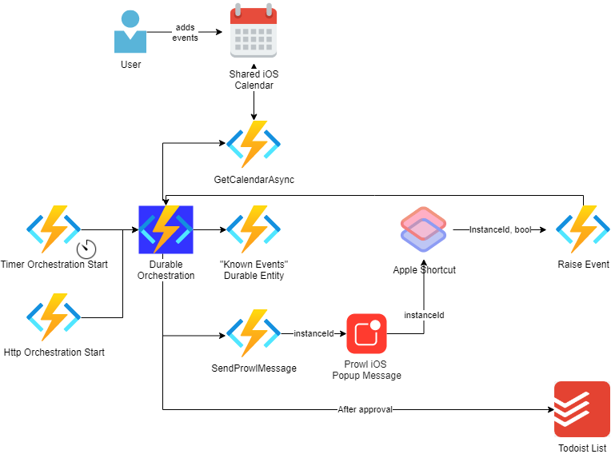

# Traverse Calendar

Traverse an iCal Feed, observe (and remember) any new events. Then notify someone of this new event, asking if they want this event tracked. If yes, then add the event to a [Todoist](https://todoist.com/) list.

## Background

Following on from the my previous project [TodoistDaysRemaining](https://github.com/MrSimonC/TodoistDaysRemaining) (where I have a [Todoist](https://todoist.com/) list I manually populate which then an Azure Function updates the days remaining), I wanted to remove the manual step of typing out new calendar events.

My wife and I have a joint Apple Calendar we share, so we can both add events to it. However, some events are more important than others: some I'll want to track and count down the days remaining. Having something to monitor this, but *ask* if we want an event tracked - then auto-adding it is super powerful.

## Technical breakdown

### Diagram

### Explanation

Wanting to learn primarily how to access Durable Entites in a Durable Orchestration (and Human Interraction Durable Orchestrations pattern), I built this in 5 nights (evenings, as I have children/work which zaps all my time in the day)! This features:

* A Durable Orchestrator Function
* A Durable Entity (aka Entity Function)
* Prowl App (for notifications)
* Apple Shortcuts app (optional - but saves me closing a browser tab on each reply)

In short, a timer/http function will kick off the orchestration. We then get the ical feed into memory, either memorise all of it (if on our first run) to an entity function, or compare those known events to these incomming ones. We then use the brilliant [`WaitForExternalEvent`](https://docs.microsoft.com/en-us/azure/azure-functions/durable/durable-functions-external-events?tabs=csharp) in Durable Orchestrations to wait for a response. At this point, my iPhone will have a [Prowl App](https://www.prowlapp.com/) notification with a `shortcut://` url attached. When launched, this runs an Apple Shortcut which asks the user to approve/ignore, and if approved, will call a normal Azure Function (technically not needed) which will raise an event to the Orchestrator. The Orchestrator then contacts Todoist, adds the entry (and date).

After all this has occurred my original [TodoistDaysRemaining](https://github.com/MrSimonC/TodoistDaysRemaining) system will pick up the event and update it with days remaining.

## Environment Variables

* HTTPS_ICAL_FEED - the share link from apple calendar (which starts "webcal", so change that to "https") e.g. https://p11-caldav.icloud.com/published/1/...
* PROWL_API_KEY - your prowl API key e.g. 123456789
* TODOIST_API_KEY - your Todoist API key e.g. a0123456789
* TODOIST_LIST - name of your Todoist list e.g. "my list"
* RAISE_APPROVAL_EVENT_URL - Azure url (with no ending slash) to your Azure function which handles approvals "http://<myAzureHosting>/api/RaiseApprovalEvent
* USE_APPLE_SHORTCUTS - true/false. If True, this will send the Orchestration Instance Id to a shortcut named "Raise Event". If false, then two prowl messages will be sent - each with their own link to approve/ignore the event